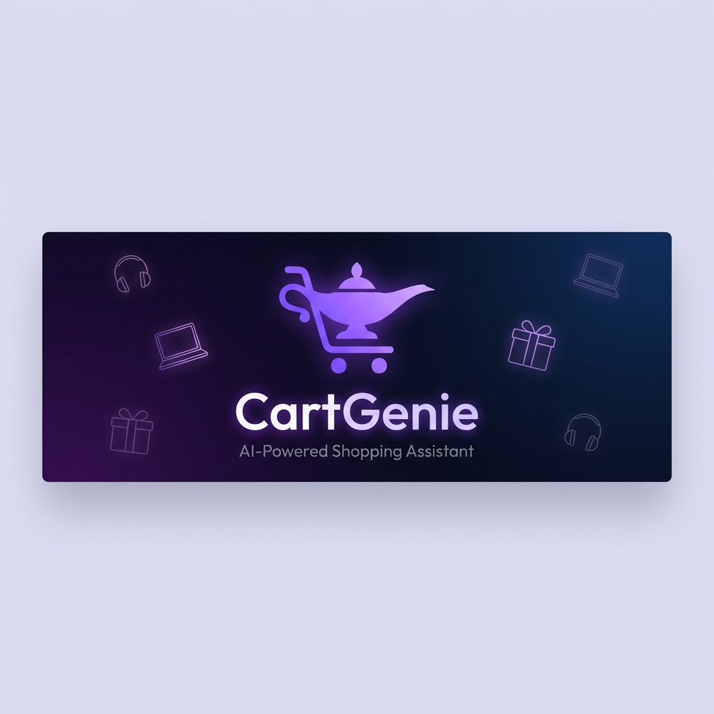
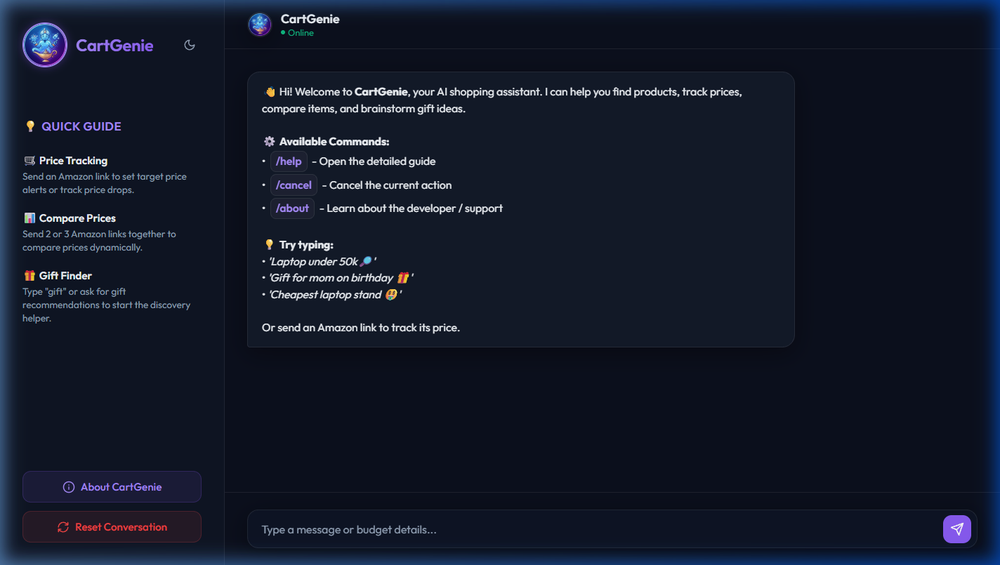
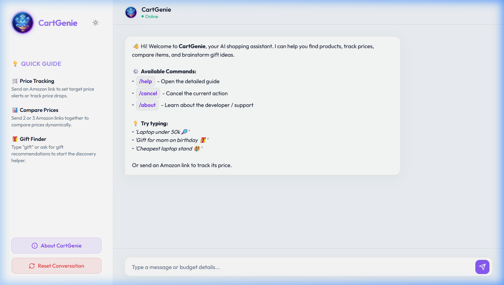

  

  
  

  
  
  
  
  

---

# 🛍️ CartGenie — AI-Powered Shopping Assistant

**CartGenie** is a fully functional, AI-driven shopping assistant operating simultaneously on [Telegram](https://t.me/CartGenieAI_bot) and a [Web Chat Interface](https://cartgenie.bot.nu). **For users who prefer not to use Telegram**, the web interface offers a complete browser-based chat experience with 100% feature parity, including dark mode, responsive mobile layouts, and interactive command buttons. Designed to operate entirely at zero infrastructure cost, it automates e-commerce product research, sentiment-based review extraction, price monitoring, and personalized gift brainstorming through simple natural language conversation.

> **Note:** This is a portfolio showcase repository. The core implementation is kept in a private repository to protect proprietary scraping mechanics and API configurations.

---

## 🚀 Core Features

### ⚖️ Side-by-Side Product Comparison
Just paste 2 or 3 Amazon product links into the chat. CartGenie runs a parallel scraping job to extract specifications and customer reviews, applying a custom value-ranking formula to recommend the best pick based on rating distribution, review density, and price point.

### 💬 Sentiment-Aware Review Summary
Get an instant pros and cons breakdown for any product by asking CartGenie to summarize its reviews. The assistant extracts real buyer feedback, groups sentences by positive and negative themes, and provides a clear recommendation verdict.

### 📉 Smart Price Alerts
Send a product link to monitor its price. Set a target price threshold, and CartGenie's background checker will alert you via push notification the moment the price drops. You can also save products directly to a personal wishlist.

### 🔍 Natural Language Smart Search
Tell the assistant what you need in plain terms (e.g., *"best noise-cancelling headphones under ₹5,000"*). CartGenie parses the query, identifies category boundaries to filter out unrelated accessories, and ranks search results using a proximity-to-budget valuation model.

### 🎁 Multi-Step Gift Helper
Struggling to find a gift? Type `gift` to start a simple conversational helper that collects budget, recipient, and occasion constraints. It performs live web research to discover trending suggestions, brainstorms categories, and presents direct product suggestions.

---

## 🎨 Screenshots

### Web Chat Interface (Dark Mode)

  

### Web Chat Interface (Light Mode)

  

---

## 🛠️ Technology Stack

- **Core Engine:** Python 3.11 with `asyncio` for concurrent scraping and non-blocking message processing.
- **Scraping Pipeline:** Playwright (Headless Chromium) configured with custom stealth modules.
- **Language Intelligence:** Groq LLM API (Llama 3.3 70B) for parsing buyer intents, backed by a robust local regex fallback parser.
- **Data Persistence:** SQLite database via `aiosqlite` for lightweight, transaction-safe storage.
- **Delivery Channels:** `python-telegram-bot` for messaging, and `aiohttp` for serving the Web Chat REST API.

---

## 📈 System Overview & Architecture

For a high-level visual walkthrough of how the system routes client requests, manages deployment, and handles technical decisions, view the **[System Overview Guide](docs/system_overview.md)**.

---

## 📝 Release History / Changelog

### **Version 3.0 (Latest Release)**
- **Decoupled Modular Framework:** Refactored the core application architecture from a monolithic state machine to a modular agent framework.
- **Connectors & Core Engine:** Implemented channel-agnostic Connectors (Telegram, Web) that generate standard Events for a unified Core Engine dispatcher.
- **Plugin Registry:** Isolated all core business logic into decoupled Python plugins (Skills) loaded dynamically by a Plugin Registry.
- **Declarative Flows:** Employed a Strangler Fig migration strategy to incrementally replace hardcoded conversation logic with declarative YAML-based flow configurations.

### **Version 2.0 (Theme & UI Update)**
- **User Interface Overhaul:** Added a sleek, responsive theme toggle (light/dark mode) with persistent preference saving.
- **Mobile optimization:** Redesigned the web sidebar layout into a collapsible drawer menu for screens under 768px.
- **UI Enhancements:** Introduced inline command button formatting, interactive list options, and clean custom scrollbars.

### **Version 1.0 (Core Launch)**
- **Platform Release:** Launched primary shopping capabilities: multi-link comparison, review summarization, price tracking, natural language search, and the gift curation helper.
- **Bridges:** Implemented the web-to-bot chat bridge, utilizing mock Telegram updates to achieve 100% feature parity between Web and Telegram.
- **Monetization:** Integrated automated affiliate tag injection for all outgoing Amazon URLs.
