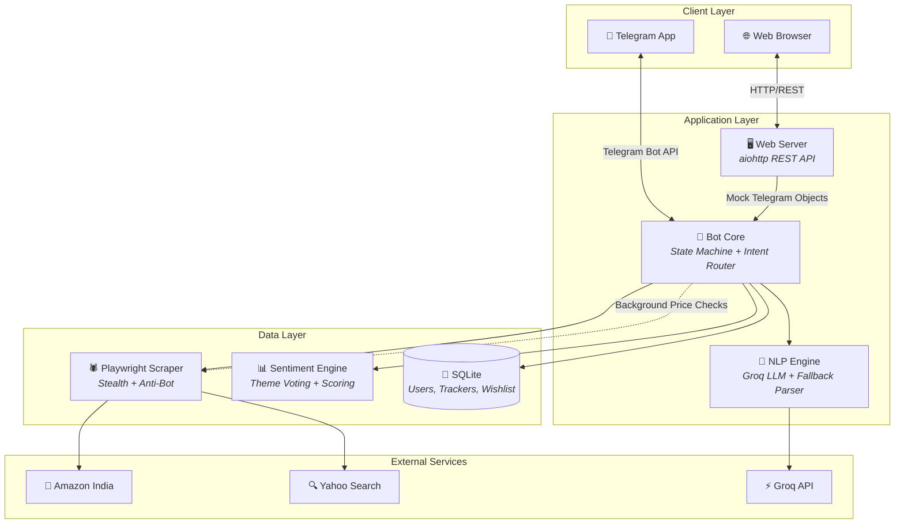

  

  
  

  
  
  
  
  

---

# 🛍️ CartGenie — AI-Powered Shopping Assistant

**CartGenie** is a production-grade, AI-driven shopping assistant available on both [Telegram](https://t.me/CartGenieAI_bot) and a [Web Chat interface](https://cartgenie.bot.nu). It removes the friction of modern e-commerce by automating product research, price monitoring, review analysis, and deal discovery — all through natural language conversation.

> **Note:** This is a showcase repository for portfolio purposes. The implementation lives in a private codebase. This repository provides architecture-level documentation, design rationale, selected screenshots, and a demo walkthrough.

---

## 📋 Table of Contents

- [Problem Statement](#-problem-statement)
- [My Role & Responsibilities](#-my-role--responsibilities)
- [Key Features](#-key-features)
- [Technology Stack](#-technology-stack)
- [Architecture Summary](#-architecture-summary)
- [Screenshots & Demo](#-screenshots--demo)
- [Deployment Summary](#-deployment-summary)
- [Security & Privacy](#-security--privacy)
- [Design Decisions & Tradeoffs](#-design-decisions--tradeoffs)
- [Outcomes & Impact](#-outcomes--impact)
- [Documentation](#-documentation)
- [About the Developer](#-about-the-developer)

---

## 🎯 Problem Statement

Online shopping is broken for the average consumer:

- **Information overload** — Comparing products across tabs, parsing hundreds of reviews, and tracking price fluctuations requires hours of manual effort.
- **Decision fatigue** — Choosing between similar products without clear, structured data leads to poor purchasing decisions or abandoned carts.
- **Missed savings** — Price drops, restocks, and time-limited offers go unnoticed because no one has time to monitor them continuously.
- **Gift anxiety** — Finding meaningful gifts under budget constraints involves scattered research across forums, blogs, and storefronts.

**CartGenie solves this** by acting as a personal shopping researcher — powered by web scraping, natural language understanding, and LLM-driven intelligence — that lives inside the messaging apps people already use daily.

---

## 👨‍💻 My Role & Responsibilities

I am the **sole developer and architect** of CartGenie, responsible for the entire product lifecycle:

| Area | Responsibilities |
|---|---|
| **Architecture & Design** | System architecture, state machine design, conversation flow modelling, database schema |
| **Backend Development** | Bot core logic, intent parsing engine, product scraping pipeline, sentiment analysis, affiliate integration |
| **Frontend Development** | Web chat interface (HTML/CSS/JS), responsive design, dark/light theming, mobile hamburger menu |
| **AI/NLP Integration** | LLM prompt engineering (Groq/Llama 3.3 70B), rule-based fallback parser, budget/intent extraction |
| **Infrastructure & DevOps** | Docker containerisation, Caddy reverse proxy with auto-TLS, VPS deployment, process management |
| **Product & UX** | Conversation UX design, inline keyboard interactions, error recovery flows, user-facing copy |

---

## ✨ Key Features

### ⚖️ Product Comparison (Multi-Link)
Drop 2–3 Amazon product links into the chat for an instant side-by-side breakdown. Each product is scored using a **mathematical recommendation engine** that combines logarithmic price scaling, review trust modifiers, and sentiment analysis to surface the best value pick.

### 💬 Review Summarisation
Request a review summary for any Amazon product. The system scrapes and classifies customer reviews into structured **Pros** and **Cons** using sentence-level sentiment analysis, then delivers a purchase verdict (Highly Recommended / Neutral / Caution).

### 📉 Price Tracking & Alerts
Set a custom target price on any product. CartGenie monitors it silently in the background and sends an instant notification the moment the price drops below your threshold. Supports both target-price alerts and wishlist-based drop monitoring.

### 🔍 Search & Discover (Natural Language)
Describe what you want in plain words — *"best noise-cancelling headphones under ₹5,000"* — and the system parses your intent, extracts budget constraints, searches Amazon, filters out accessories and sponsored noise, and ranks results using a proximity-weighted value formula.

### 🎁 Gift Finder
Describe a gift scenario (recipient, occasion, budget) and CartGenie will:
1. **Research** discussion boards and gift guides via live web search
2. **Brainstorm** three tailored product categories using an LLM
3. **Search** Amazon for the best matches within budget

### 🌐 Web Chat Interface
A fully responsive browser-based chat that mirrors the Telegram experience. Features include dark/light theme toggle, interactive command buttons, a sidebar quick guide, and a collapsible hamburger menu for mobile.

---

## 🛠️ Technology Stack

| Layer | Technology | Purpose |
|---|---|---|
| **Bot Framework** | python-telegram-bot v22 | Telegram Bot API, conversation state machine, inline keyboards |
| **Web Scraping** | Playwright (Headless Chromium) | Amazon product scraping, review harvesting, search page crawling |
| **NLP / LLM** | Groq API (Llama 3.3 70B) | Intent classification, budget extraction, gift brainstorming, search optimisation |
| **Sentiment Analysis** | Custom keyword lexicon engine | Sentence-level pro/con classification, theme-based voting, verdict scoring |
| **Web Server** | aiohttp | REST API for web chat bridge, static file serving |
| **Database** | SQLite via aiosqlite | User tracking, price alert storage, wishlist persistence |
| **Frontend** | HTML5, CSS3 (custom), Vanilla JS | Responsive chat UI, theme switching, session management |
| **Containerisation** | Docker + Docker Compose | Reproducible deployment with Playwright browser dependencies |
| **Reverse Proxy** | Caddy | Automatic HTTPS/TLS, domain routing |
| **Language** | Python 3.11+ | Async-first architecture with asyncio |

---

## 🏗️ Architecture Summary

### Key Architecture Highlights

- **Dual-Channel Delivery** — The same bot core serves both Telegram and Web users. The web server creates mock Telegram update objects that route through the identical state machine, ensuring feature parity across channels.
- **AI-First Intent Routing** — User messages pass through an LLM-powered intent parser (with rule-based fallback) that classifies intent and extracts structured parameters (budget, product type, modifiers) in a single API call.
- **Deterministic URL Extraction** — Amazon URLs in messages are parsed deterministically *before* NLP processing, ensuring reliable routing regardless of surrounding text.
- **Background Price Loop** — An asyncio background task runs periodic price checks with semaphore-bounded concurrency, notifying users of threshold crossings via Telegram push messages.

> 📄 **Deep dive:** [docs/architecture.md](docs/architecture.md)

---

## 📸 Screenshots & Demo

### Web Chat Interface — Dark Mode

  

### Web Chat Interface — Light Mode

  

### 🔗 Try It Live

| Platform | Link |
|---|---|
| **Web Chat** | [cartgenie.bot.nu](https://cartgenie.bot.nu) |
| **Telegram** | [@CartGenieAI_bot](https://t.me/CartGenieAI_bot) |

---

## 🚀 Deployment Summary

CartGenie runs as a **Dockerised service** on a Linux VPS with the following setup:

| Component | Detail |
|---|---|
| **Container** | Docker Compose with Playwright base image (`mcr.microsoft.com/playwright/python`) |
| **Reverse Proxy** | Caddy with automatic Let's Encrypt TLS certificates |
| **Persistence** | SQLite database file + log file mounted as Docker volumes |
| **Process Safety** | File-lock based single-instance guard prevents duplicate polling sessions |
| **Restart Policy** | `unless-stopped` for automatic recovery from crashes |
| **Monitoring** | Structured per-module logging with rotating file output |

> 📄 **More details:** [docs/deployment.md](docs/deployment.md)

---

## 🔒 Security & Privacy

| Concern | Implementation |
|---|---|
| **Credential Isolation** | All secrets stored in `.env` file; never logged, printed, or sent to users |
| **Token Validation** | Bot token format validated with regex before startup to catch misconfiguration early |
| **No PII Logging** | User messages are logged for debugging but no personal data is stored beyond Telegram user IDs |
| **Instance Locking** | File-based lock (`fcntl.LOCK_EX`) prevents multiple bot instances from running simultaneously, avoiding Telegram API conflicts |
| **Scraper Stealth** | Rotating user agents, cookie persistence, custom HTTP headers, and WebDriver flag removal to avoid detection |
| **Error Isolation** | User-facing errors include unique error codes for traceability without exposing stack traces |
| **Input Sanitisation** | URL extraction uses strict regex patterns; budget parsing validates numeric boundaries |

---

## 🧠 Design Decisions & Tradeoffs

| Decision | Rationale |
|---|---|
| **Local Playwright scraping** vs. paid APIs (Keepa, Rainforest) | Zero-cost constraint; built custom stealth mechanisms and graceful fallback instead |
| **Groq LLM with rule-based fallback** vs. LLM-only | Ensures the bot never goes silent — if the API is down or rate-limited, the fallback parser still routes intents correctly |
| **Logarithmic price scaling** in product scoring | Prevents expensive products from dominating recommendations; normalises price impact across categories |
| **Category anchoring** for accessory filtering | Maintains baseline price floors per product category to prevent search pollution (e.g., phone chargers appearing in phone searches) |
| **Mock Telegram objects** for web bridge | Reuses the entire Telegram state machine without duplication; web requests are translated into mock Update objects that flow through the same handler pipeline |
| **Sentence-level theme voting** for sentiment | More nuanced than word-count sentiment; groups review sentences by theme (build quality, value, delivery) and lets direction (positive/negative) emerge from voting |

> 📄 **Full analysis:** [docs/design-decisions.md](docs/design-decisions.md)

---

## 📈 Outcomes & Impact

- **Live in production** — serving real users across Telegram and Web simultaneously
- **Zero operational cost** — runs entirely on self-hosted infrastructure with no paid APIs for scraping or data
- **Dual-channel feature parity** — identical conversation experience on both Telegram and the web interface
- **Affiliate monetisation** — every product link is automatically rewritten with affiliate tags, creating a passive revenue stream
- **Sub-second intent parsing** — LLM-powered intent classification with automatic fallback ensures responsive conversation flow
- **Resilient scraping** — graceful recovery from anti-bot challenges with user-friendly error messages and direct affiliate links as fallback

---

## 📚 Documentation

| Document | Description |
|---|---|
| [Architecture Deep Dive](docs/architecture.md) | Component breakdown, data flow, concurrency model, web bridge design |
| [Design Decisions](docs/design-decisions.md) | Technical tradeoffs, scoring algorithms, NLP strategy, scraper design |
| [Deployment Guide](docs/deployment.md) | Sanitised ops documentation, Docker setup, TLS configuration |
| [Features & User Flows](docs/features.md) | Exhaustive feature list with state machine flows and output formats |
| [Testing & Observability](docs/testing-observability.md) | Logging strategy, error handling, fallback chains, monitoring |
| [Changelog](CHANGELOG.md) | Sanitised release history |

---

## 👤 About the Developer

**Jyothis Thaliath** — Full-stack developer and the sole architect behind CartGenie.

| | |
|---|---|
| 🌐 **Portfolio** | [jyothisthaliath.github.io](https://jyothisthaliath.github.io) |
| 💬 **Telegram** | [@jyothisthaliath](https://t.me/jyothisthaliath) |

---

  This repository serves as a portfolio showcase. The source code is maintained in a private repository.

