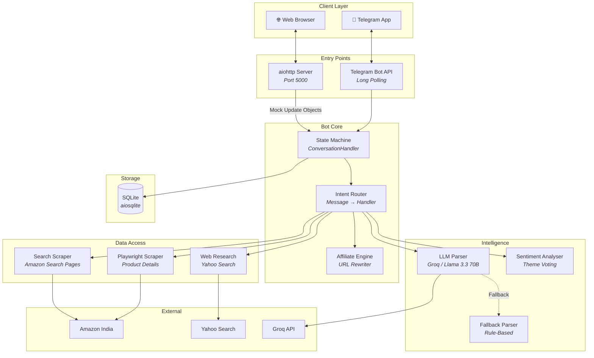
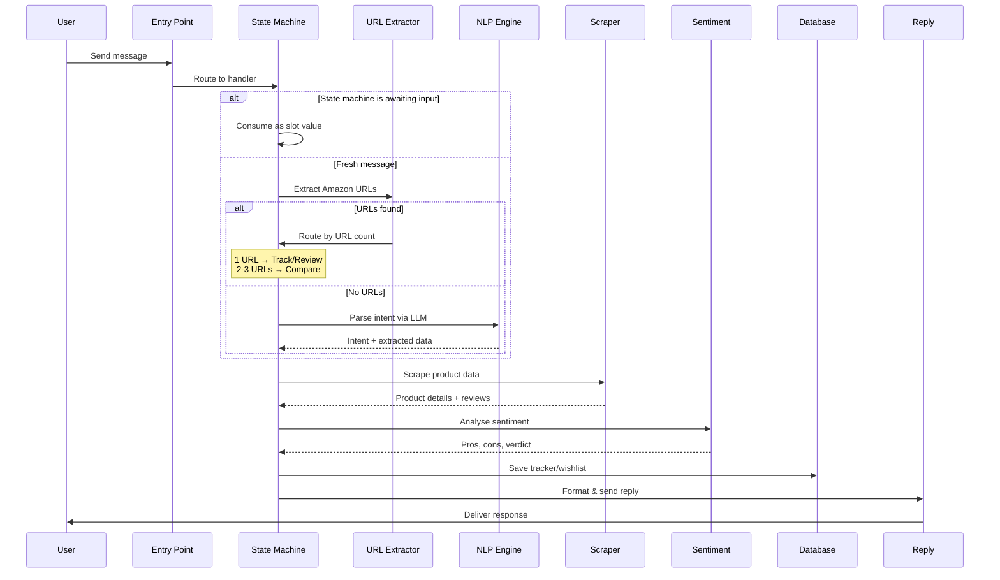
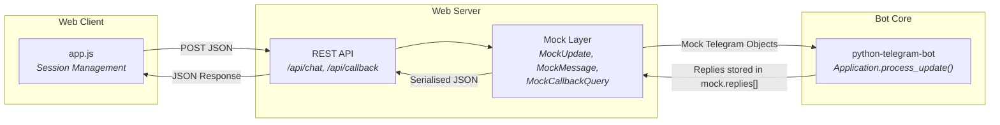
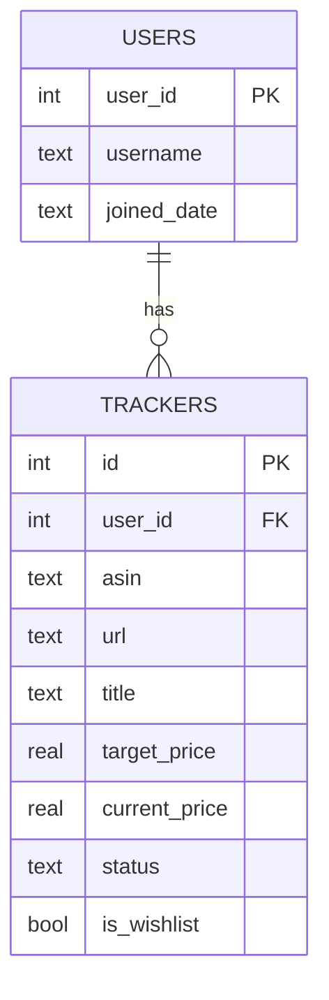

# Architecture Deep Dive

> This document provides a detailed technical overview of CartGenie's system architecture. The implementation resides in a private codebase; this is an architecture-level summary.

---

## System Overview

CartGenie is built as an **async-first Python application** that serves two client channels (Telegram and Web) through a unified bot core. The system is designed around four primary subsystems:

1. **Conversation Engine** — State machine that manages multi-step user flows
2. **Scraping Pipeline** — Headless browser automation for product data extraction
3. **Intelligence Layer** — LLM-powered NLP with rule-based fallback
4. **Data Persistence** — Lightweight relational storage for users, trackers, and wishlists

---

## Component Architecture

---

## Data Flow: Message Processing

Every incoming message follows this pipeline:

---

## Concurrency Model

CartGenie runs on a **single asyncio event loop** with the following concurrent operations:

| Component | Concurrency Mechanism | Detail |
|---|---|---|
| **Message Handling** | asyncio coroutines | Each user message is processed as an async coroutine |
| **Product Scraping** | Parallel `asyncio.gather()` | Comparison scrapes run in parallel for 2-3 products |
| **Background Price Checks** | `asyncio.Semaphore` | Bounded concurrency (configurable, default: 2 concurrent checks) |
| **Price Check Loop** | `asyncio.sleep()` loop | Periodic background task (configurable interval, default: 1 hour) |
| **Web Server** | aiohttp `AppRunner` | Serves web chat alongside the bot on the same event loop |

### Instance Safety
A file-based lock (`fcntl.LOCK_EX | LOCK_NB`) ensures only one bot process can run at a time. This prevents the Telegram `Conflict` error that occurs when multiple processes poll the same bot token.

---

## Web Chat Bridge

The web interface achieves full feature parity with Telegram through an innovative **mock object translation layer**:

**Key design decision:** Instead of building a separate handler pipeline for the web, we create mock `Update`, `Message`, and `CallbackQuery` objects that extend the real `python-telegram-bot` classes. These mock objects override reply methods (`reply_html`, `reply_text`, `reply_photo`) to capture responses into a list, which is then serialised and returned to the web client.

This approach means:
- **Zero code duplication** — Every feature, flow, and edge case works identically on both channels
- **Automatic feature parity** — New Telegram features automatically work on the web
- **Session isolation** — Web sessions are mapped to stable integer user IDs via MD5 hashing

---

## Database Schema

The database is intentionally lightweight — SQLite with async access via `aiosqlite`. It stores:
- **Users**: Telegram user IDs and usernames
- **Trackers**: Active price alerts and wishlist items with current/target prices and status

---

## Affiliate Monetisation Flow

Every product URL that leaves the system passes through a centralised sanitisation pipeline:

1. **Strip existing parameters** — Remove any pre-existing tracking, marketing, or affiliate tags
2. **Inject affiliate tag** — Append the configured Amazon Associate ID
3. **Return clean URL** — The final URL contains only the product path and affiliate tag

This applies uniformly to: comparison charts, review summaries, price alert notifications, search results, and gift recommendations.
