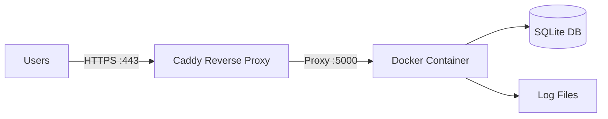

# Deployment Guide

> Sanitised deployment documentation for CartGenie. No secrets or credentials disclosed.

---

## Overview

CartGenie runs as a **Dockerised service** on a Linux VPS behind a Caddy reverse proxy with automatic TLS.

---

## Container Setup

| Property | Value |
|---|---|
| **Base Image** | `mcr.microsoft.com/playwright/python:v1.47.0-jammy` |
| **Exposed Port** | 5000 (web chat) |
| **Restart Policy** | `unless-stopped` |
| **Volumes** | Project dir mounted for DB + log persistence |
| **Environment** | Loaded from `.env` (never baked into image) |

---

## Reverse Proxy & TLS

**Caddy** provides automatic HTTPS via Let's Encrypt, HTTP/2 support, and zero-config certificate renewal. Routes `cartgenie.bot.nu → localhost:5000`.

---

## Process Safety

- **File lock** (`fcntl.LOCK_EX`) prevents duplicate polling instances
- **Auto-restart** via Docker `unless-stopped` policy
- **Token validation** — regex check at startup catches misconfigured tokens

---

## Environment Configuration

All secrets stored in `.env`, loaded via `python-dotenv`, validated at startup. Categories: API credentials, affiliate settings, tuning parameters, logging config, database path.

---

## Monitoring

- Per-module structured loggers with dual output (file + stdout)
- Unique error codes in user-facing messages for traceability
- Noisy library loggers suppressed unless DEBUG mode
- Background price check loop logs each cycle
