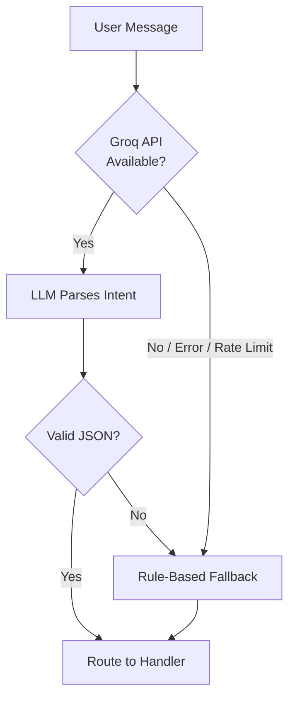

# Design Decisions & Tradeoffs

> This document captures the key technical decisions made during CartGenie's development, the alternatives considered, and the reasoning behind each choice.

---

## 1. Local Playwright Scraping vs. Paid Data APIs

### Decision
Use headless Playwright (Chromium) for all product data extraction instead of commercial APIs like Keepa, Rainforest API, or ScraperAPI.

### Alternatives Considered
| Option | Monthly Cost | Reliability | Coverage |
|---|---|---|---|
| **Keepa API** | $19–49+ | Very high | Price history, product data |
| **Rainforest API** | $49–199+ | Very high | Full Amazon data |
| **ScraperAPI** | $29–99+ | High | Proxy rotation |
| **Local Playwright** | $0 | Medium | Full control |

### Rationale
CartGenie operates under a strict **zero-cost budget constraint**. Rather than accepting limited free tiers that would throttle the bot, we invested in building robust stealth mechanisms:

- **Cookie persistence** — Maintains session cookies across requests to avoid cold-start challenges
- **Rotating user agents** — Cycles through realistic browser fingerprints
- **Custom HTTP headers** — Mimics real browser request patterns
- **Programmatic scrolling** — Triggers lazy-loaded content (especially reviews)
- **WebDriver flag removal** — Prevents basic automation detection

### Tradeoff
Lower reliability compared to paid APIs — occasional captcha blocks require graceful degradation. The system falls back to a user-friendly error message with a direct affiliate link when scraping fails.

---

## 2. LLM Intent Parsing with Rule-Based Fallback

### Decision
Use Groq's Llama 3.3 70B model for intent classification as the primary parser, with a complete rule-based fallback system.

### Architecture


### Rationale
- **LLM-first**: Groq's free tier provides fast inference for natural language understanding, correctly handling ambiguous queries, slang, and multi-intent messages
- **Fallback is non-negotiable**: The bot must never go silent. If the API returns a 429 (rate limit), 500, or times out, the fallback parser uses keyword matching, regex budget extraction, and heuristic intent detection to still route the message correctly
- **Retry with backoff**: On 429 responses, the system waits 1.5 seconds and retries once before falling back

### Tradeoff
The fallback parser is less accurate with complex or ambiguous queries, but ensures 100% uptime for intent routing.

---

## 3. Product Scoring Algorithm

### Decision
Use a multi-factor mathematical scoring formula rather than simple price sorting or rating sorting.

### The Formula

**Standard comparison scoring:**
```
Score = Rating × trust_modifier × sentiment_modifier
```

Where:
- `trust_modifier = min(1.0, log10(reviews_count) / log10(1000))` — Products with more reviews get higher trust
- `sentiment_modifier = 1.0 + (sentiment_ratio × 0.2)` — Positive reviews boost score by up to 20%
- Products rated below 3.7 are disqualified entirely

**Search & Discover scoring (budget-aware):**
```
Score = (1.0 × EffectiveRating) + (0.2 × ln(ReviewCount)) + (2.0 × Price/BudgetMax)
```

### Rationale
- **Logarithmic price scaling** prevents expensive products from dominating through raw price alone
- **Trust modifier** rewards products with statistically significant review volumes
- **Sentiment modifier** factors in qualitative review content, not just star ratings
- **Budget proximity weighting** (for search) rewards products that utilise the user's budget effectively — users searching "under ₹50,000" typically want premium products, not the cheapest option

### Tradeoff
The 3.7 rating threshold is opinionated and may exclude niche products with small but enthusiastic user bases.

---

## 4. Category Anchoring for Accessory Filtering

### Decision
Implement per-category baseline price floors and accessory keyword blocklists to prevent search result pollution.

### Problem
When searching "best phone under 15000", Amazon returns a mix of phones, phone cases, chargers, power banks, and screen protectors. Without filtering, these accessories pollute the top results.

### Solution
```
Category: "phone"
├── Baseline Price Floor: ₹5,000
├── Accessory Keywords: ["powerbank", "charger", "case", "cover", "adapter", ...]
└── Negative Keywords: ["cable", "guard", "glass", "holder", "stand", ...]
```

**Filtering pipeline:**
1. Map the core product noun to a category key (e.g., "phone", "laptop", "headphone")
2. Reject products priced below the category's baseline floor
3. Reject products whose titles contain known accessory keywords
4. Skip keyword filtering if the term matches a user-specified modifier (e.g., user asks for "phone with charger" — don't filter "charger")

### Tradeoff
Hardcoded category mappings require maintenance as product landscapes evolve. The system falls back gracefully by relaxing filters in stages if zero results pass strict criteria.

---

## 5. Mock Object Web Bridge vs. Separate Handler Pipeline

### Decision
Extend `python-telegram-bot` classes (`Update`, `Message`, `CallbackQuery`) with mock subclasses that capture replies, rather than building a parallel web handler system.

### Alternatives Considered
1. **Separate web handlers** — Duplicate all bot logic for HTTP endpoints
2. **Shared service layer** — Extract common logic into services called by both handlers
3. **Mock object translation** (chosen) — Translate web requests into mock Telegram objects

### Rationale
Option 3 provides **zero code duplication** and **automatic feature parity**. When a new feature is added to the Telegram bot, it immediately works on the web without any additional development. The mock objects override:
- `reply_html()`, `reply_text()`, `reply_photo()` — Capture into a replies list
- `edit_text()`, `edit_caption()` — Update the mock message state
- `delete()` — Record deletion events
- `answer()` — No-op for callback queries

### Tradeoff
Tight coupling to `python-telegram-bot` internals — major library version upgrades may require mock class updates. However, the library has a stable API surface.

---

## 6. Sentence-Level Theme Voting for Sentiment Analysis

### Decision
Classify review sentiment using theme-based sentence voting rather than word-level counting.

### How It Works
1. **Define themes** — Each theme has trigger keywords, a pro label, and a con label (e.g., "sturdy/stable/solid" → Pro: "Praised for sturdy construction")
2. **Score per sentence** — For each sentence containing a theme's keywords, check for negation markers ("not", "didn't", "poor") to determine direction
3. **Vote** — Each sentence casts a pro or con vote for the relevant theme
4. **Rank** — Themes with the most decisive pro/con margins surface to the top

### Rationale
Simple positive/negative word counting produces generic, product-agnostic results. Theme voting produces **product-specific insights** — different products naturally surface different themes based on what reviewers discuss.

### Tradeoff
The theme dictionary is finite and may miss domain-specific sentiment signals. However, the fallback phrases ("Generally well-received" / "No significant issues") ensure clean output even when no theme matches strongly.

---

## 7. Gift Finder: Web Research + LLM Brainstorming

### Decision
Use live web search (Yahoo) to gather contextual data, then pass it to an LLM for gift category brainstorming, rather than relying on a static gift database.

### Pipeline
```
User Input → Slot Filling → Yahoo Search → Context Extraction → LLM Brainstorm → Amazon Search → Results
```

### Rationale
- **Live web search** captures current trends, seasonal recommendations, and community consensus from forums and discussion boards
- **LLM brainstorming** with search context produces more creative and contextually relevant suggestions than a static lookup table
- **Targeted Amazon search** for the selected category ensures the final results are purchasable and within budget

### Tradeoff
Adds latency (web scraping + LLM API call) compared to instant static lookups. The rule-based fallback categories ensure the feature works even when both the web search and LLM API fail.

---

## 8. SQLite vs. PostgreSQL

### Decision
Use SQLite with async access via `aiosqlite` instead of a full RDBMS.

### Rationale
- CartGenie is a single-instance application — no need for concurrent multi-process database access
- SQLite requires zero configuration and zero additional infrastructure
- The data model is simple (two tables) and write volume is low
- Database file can be easily backed up, inspected, and mounted as a Docker volume

### Tradeoff
Cannot scale to multiple bot instances or high write concurrency. This is acceptable for the current single-instance architecture.
