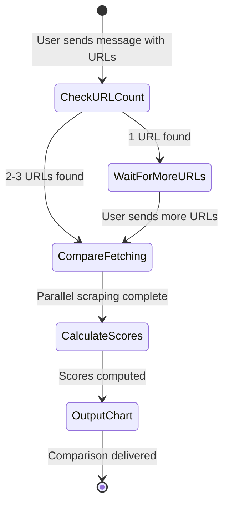
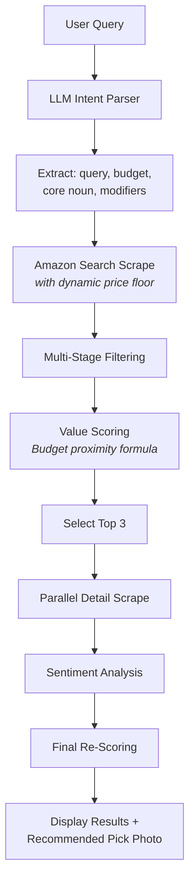
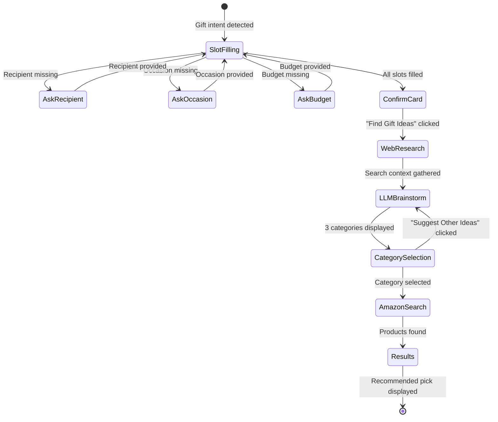

# Features & User Flows

> Exhaustive feature documentation with state machine flows and output formats.

---

## 1. ⚖️ Product Comparison

**Trigger:** Send 2–3 Amazon product links in a single message.

### User Flow


### Processing Steps
1. **Parallel scraping** — All product pages scraped simultaneously via `asyncio.gather()`
2. **Data extraction** — Price, rating, review count, stock status, key feature bullets
3. **Review harvesting** — Top 8 reviews scraped via programmatic scrolling
4. **Sentiment analysis** — Theme-based pro/con extraction per product
5. **Score calculation** — Logarithmic price scaling × trust modifier × sentiment modifier
6. **Recommendation** — Highest-scoring product tagged as "Recommended Pick"

### Output Format
- Numbered product cards with price, rating, stock, key feature, top pro/con
- Recommended Pick section with justification and "🛍️ Buy on Amazon" affiliate link

---

## 2. 💬 Review Summarisation

**Trigger:** "Summarise reviews for [Amazon URL]" or "reviews [URL]"

### Processing Steps
1. **Scrape reviews** — Navigate to product page, programmatically scroll to trigger lazy-loaded review containers
2. **Clean text** — Strip boilerplate strings ("Brief content visible...")
3. **Classify sentences** — Tokenise and map against positive/negative keyword lexicons
4. **Theme voting** — Score themes (build quality, value, delivery, etc.) by sentence direction
5. **Calculate verdict** — Sentiment ratio determines: Highly Recommended / Neutral / Caution

### Output Format
- Product title with affiliate link
- Rating and review count
- Bulleted Pros (🟢) and Cons (🔴)
- Final verdict with reasoning

---

## 3. 📉 Price Tracking & Alerts

**Trigger:** Send a single Amazon product URL, or say "track [URL]"

### User Flow
```mermaid
stateDiagram-v2
    [*] --> Fetching: URL detected
    Fetching --> ProposeAction: Product details loaded
    ProposeAction --> WaitTargetPrice: "Set Target Price" selected
    ProposeAction --> SaveWishlist: "Add to Wishlist" selected
    WaitTargetPrice --> Confirm: Valid price entered
    Confirm --> Saved: User confirms
    SaveWishlist --> Saved: Direct save
    Saved --> [*]: Tracker active
    
    note right of ProposeAction: Escape hatch: new text message cancels pending state
```

### Background Monitoring
- Configurable check interval (default: 1 hour)
- Semaphore-bounded concurrency prevents overwhelming Amazon
- **Target price alerts**: Triggered when price crosses below threshold
- **Wishlist alerts**: Triggered on any price drop from last recorded price

---

## 4. 🔍 Search & Discover

**Trigger:** Natural language queries like "best noise-cancelling headphones under ₹5,000"

### Processing Pipeline


### Filtering Stages (Progressive Relaxation)
1. **Strict** — Sponsored filter + budget ceiling + review minimum (≥10) + price floor + keyword alignment + accessory filter
2. **Relax price floor** — Drop dynamic quality floor
3. **Relax keywords** — Drop optional modifier matching
4. **Relax accessory filter** — Allow accessory-like titles
5. **Relax reviews** — Allow products with <10 reviews
6. **Relax sponsored** — Allow sponsored items

### Modifier Classification
- **Required modifiers**: Specs the user explicitly asked for (AND logic, never relaxed)
- **Optional modifiers**: LLM-inferred tier specs (OR logic, relaxable)

---

## 5. 🎁 Gift Finder

**Trigger:** "Gift for my sister's birthday under 5000" or type "gift"

### User Flow


### Pipeline Detail
1. **Slot filling** — Sequential prompts with inline buttons for recipient, occasion, budget
2. **Confirmation card** — Summary with Edit Budget / Find Ideas / Cancel options
3. **Web research** — Yahoo Search scrapes discussion boards and gift guides
4. **LLM brainstorming** — Groq Llama 3.3 generates 3 gift categories with reasoning
5. **Amazon search** — Targeted product search for the selected category within budget
6. **Results** — Top picks with recommended product photo and "Buy on Amazon" button

---

## 6. 🌐 Web Chat Interface

**Access:** [cartgenie.bot.nu](https://cartgenie.bot.nu)

### Features
- **Full feature parity** with Telegram bot (every flow works identically)
- **Dark / Light theme** toggle with persistent preference
- **Interactive command links** — `/help`, `/cancel`, `/about` rendered as clickable buttons
- **Inline keyboard buttons** — Identical to Telegram inline keyboards
- **Product photo cards** — Rich cards with contained images and captions
- **Typing indicator** — Animated dots during bot processing
- **Sidebar quick guide** — Help content displayed in a persistent sidebar
- **Mobile responsive** — Collapsible hamburger menu for screens under 768px
- **Session persistence** — UUID-based sessions stored in localStorage

---

## Global Conversation Controls

### Cancel
Available at every step via inline button or by typing "cancel". Clears all in-memory state and resets the conversation.

### Clarification UX
When intent is ambiguous or required parameters are missing, the bot presents inline buttons to guide the user instead of showing an error.

### State Escape Hatch
If the user sends a new text message while the bot is waiting for a button tap, the pending flow is automatically cancelled and the new message is processed as a fresh request.
