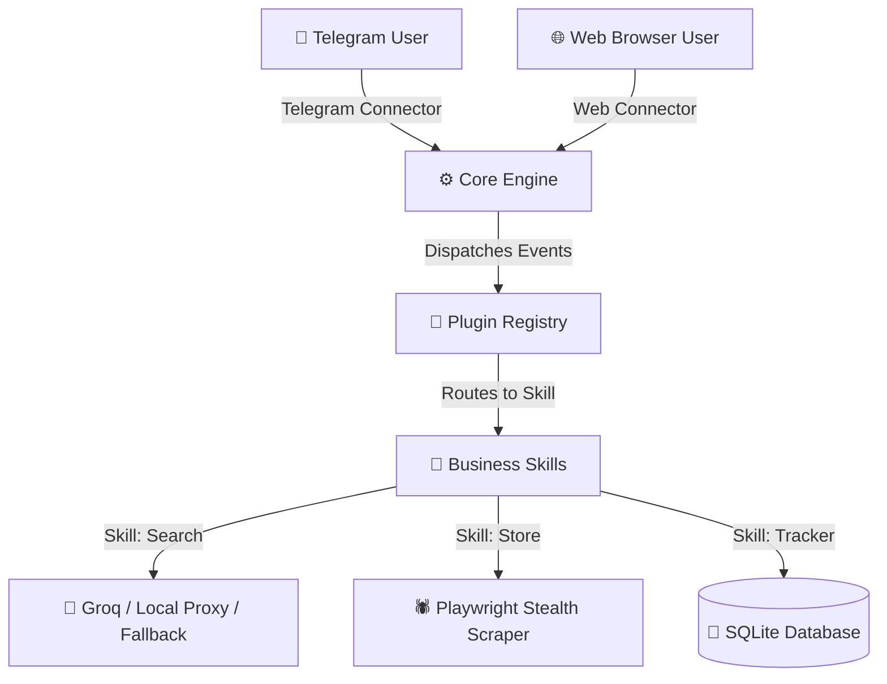
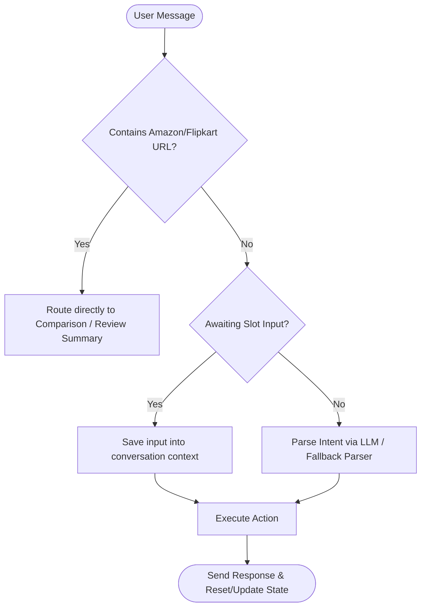
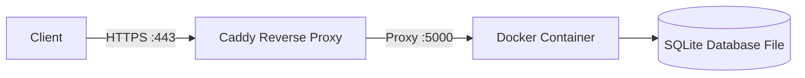

# ⚙️ CartGenie — System Overview

This document provides a high-level overview of how CartGenie is built, how it is deployed, and the core engineering decisions made during its design.

---

## 🏗️ System Architecture

CartGenie is designed to be **async-first and lightweight**, routing traffic from both Telegram and a web interface into a single, unified bot application core.

### Request Routing Block Diagram

### Decoupled Modular Framework

Instead of writing monolithic application flows for Telegram and Web chat channels, CartGenie uses a decoupled agent framework. **Connectors** translate requests into standard state-agnostic events, which are processed by the **Core Engine**. The Engine relies on a **Plugin Registry** to dynamically load and route these events to specialized **Skills**.

This design choice ensures:
- **100% Feature Parity:** Every feature updates simultaneously on both platforms since they all route through the same Core Engine.
- **Extensibility:** New conversational flows and capabilities can be added as simple YAML/JSON files or standalone Python Skills without modifying core bot infrastructure.

---

## 💬 Conversation State Flowchart

CartGenie manages multi-step interactions (such as collecting gift details or configuring a target price alert) using a structured conversation state machine.

- **Escape Hatch:** If a user types a new command (or clicks "Cancel") while a conversational flow is in progress, the active state is instantly cleared, and the new input takes priority.

---

## 🚀 VPS Deployment & Infrastructure

CartGenie is deployed on a Linux VPS using a containerized, self-hosting stack aimed at keeping operations entirely free of service fees.

- **Docker Container:** Bundles the application along with all Chromium dependencies required for Playwright scraping.
- **Caddy Reverse Proxy:** Handles SSL/TLS termination automatically, routing traffic securely to the web interface.
- **SQLite Persistence:** Mounts a local database file to preserve user alerts and wishlists between container restarts.
- **Single-Instance Guard:** An automatic process lock ensures only one instance of the bot runs at a time, preventing Telegram API conflicts.

---

## 💡 Core Design Decisions & Tradeoffs

### 1. Custom Stealth Scraping vs. Paid APIs
- **Tradeoff:** Commercial product data APIs are highly reliable but charge monthly fees.
- **Decision:** To maintain a $0 budget, CartGenie uses a custom Playwright configuration utilizing user-agent cycling, persistent browser context sharing, and stealth headers to query Amazon & Flipkart directly. If blocked, the bot gracefully falls back to sharing clean affiliate links directly.

### 2. LLM Parsing & Local Proxy Routing
- **Tradeoff:** Relying solely on external LLM APIs (like Groq) risks downtime due to API rate limits, while running entirely on local VPS resources can be slower.
- **Decision:** User queries are parsed dynamically. Selective routing is implemented to send intelligence-intensive brainstorming tasks (such as gift categories and search modifiers) to a self-hosted local LLM proxy (FreeLLMAPI), while standard intent parsing runs on Groq for sub-second latency. A local regex-based keyword parser acts as an instantaneous fallback if any API is unreachable.

### 3. Sentence-level Sentiment Tagging
- **Tradeoff:** Full LLM review processing is slow and expensive for long review text.
- **Decision:** Reviews are filtered using a custom keyword lexicon that tags sentences into positive and negative themes (such as build quality, battery life, or shipping speed) and sums votes to deliver a general recommendation verdict.
